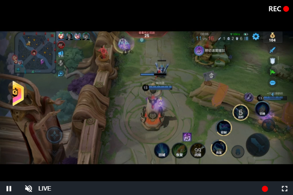

# videojs-fetch-flv

A videojs plugin to download http-flv stream



## Table of Contents

<!-- START doctoc generated TOC please keep comment here to allow auto update -->
<!-- DON'T EDIT THIS SECTION, INSTEAD RE-RUN doctoc TO UPDATE -->


- [Installation](#installation)
- [Usage](#usage)
  - [`<script>` Tag](#script-tag)
  - [ES Modules](#es-modules)
  - [Browserify/CommonJS](#browserifycommonjs)
  - [RequireJS/AMD](#requirejsamd)
- [Methods](#methods)
  - [show()](#show)
  - [hide()](#hide)
  - [updateIsLive(value)](#updateislivevalue)
  - [start()](#start)
  - [stop()](#stop)
- [Configuration](#configuration)
- [License](#license)

<!-- END doctoc generated TOC please keep comment here to allow auto update -->


## Installation

```sh
npm install --save videojs-fetch-flv
```

Other

```sh
npm install --save video.js videojs-flvjs flv.js

# or 

npm install --save video.js videojs-flvjs-es6 flv.js
```


## Usage

To include videojs-fetch-flv on your website or web application, use any of the following methods.

### `<script>` Tag

This is the simplest case. Get the script in whatever way you prefer and include the plugin _after_ you include [video.js][videojs], so that the `videojs` global is available.

```html
<script src="//path/to/video.min.js"></script>
<script src="//path/to/flv.min.js"></script>
<script src="//path/to/videojs-flvjs.min.js"></script>
<script src="//path/to/videojs-fetch-flv.min.js"></script>
<script>
  var player = videojs('my-video')
  player.fetchFlv()
</script>
```

or

```html
<script src="//path/to/video.min.js"></script>
<script src="//path/to/flv.min.js"></script>
<script src="//path/to/videojs-flvjs.min.js"></script>
<script src="//path/to/videojs-fetch-flv.min.js"></script>
<script>
  var player = videojs('my-video')
  var options = {
    isLive: false,
    ...
  }
  player.fetchFlv(options)
</script>
```

or 

```html
<script src="//path/to/video.min.js"></script>
<script src="//path/to/flv.min.js"></script>
<script src="//path/to/videojs-flvjs.min.js"></script>
<script src="//path/to/videojs-fetch-flv.min.js"></script>
<script>
  var options = {
        plugins: {
          fetchFlv: {
            isLive: false,
            ...
          }
        }
      }
  var player = videojs('my-video', options)
</script>
```

### ES Modules

Install videojs-fetch-flv via npm and `import` the plugin as you would any other module.
You will also need to import the stylesheet in some way.

```js
import videojs from 'video.js'
import 'videojs-fetch-flv'
import 'videojs-fetch-flv/dist/videojs-fetch-flv.css'

const player = videojs('my-video')
player.fetchFlv()
// player.fetchFlv({
//   isLive: true
// })
```

or

```js
import videojs from 'video.js'
import 'videojs-flvjs-es6'
import 'videojs-fetch-flv'
import 'videojs-fetch-flv/dist/videojs-fetch-flv.css'

const options = {
        plugins: {
          fetchFlv: {
            isLive: false,
            ...
          }
        }
      }
const player = videojs('my-video', options)
```


### Browserify/CommonJS

When using with Browserify, install videojs-fetch-flv via npm and `require` the plugin as you would any other module.

```js
var videojs = require('video.js')

// The actual plugin function is exported by this module, but it is also
// attached to the `Player.prototype`; so, there is no need to assign it
// to a variable.
require('videojs-fetch-flv')

var player = videojs('my-video')
player.fetchFlv()
```

### RequireJS/AMD

When using with RequireJS (or another AMD library), get the script in whatever way you prefer and `require` the plugin as you normally would:

```js
require(['video.js', 'videojs-fetch-flv'], function(videojs) {
  var player = videojs('my-video')
  player.fetchFlv()
})
```


## Methods


### show()

Show record button control


### hide()

Hide record button control


### updateIsLive(value)

update options.isLive value


### start()

When the player is playing, you can manually record.

```js
player.on('play', () => {
  player.fetchFlv().start()
})
```


### stop()

When the player is playing, you can manually stop the recording and download the recording file.

**Note:** When closing or destroying the player, if you are recording, it is best to call stop() first

```js
player.on('error', () => {
  player.fetchFlv().stop(isSaveFile)
})
```

isSaveFile: Boolean, default **false**

- **true**: stop fetch and save the media file
- **false**: stop fetch only


## Configuration

| Property      | Attributes | Type    | Default              | Description                                                  |
| :------------ | :--------: | ------- | -------------------- | ------------------------------------------------------------ |
| isLive        |  Optional  | Boolean | true                 | Download parameters. True is used to download http-flv,  false is used to download directly by the browser |
| beforeElement |  Optional  | String  | fullscreenMenuToggle | Name of the player.controlBar component for the button to be attached before |
| controlText   |  Optional  | String  | Download             | String for the control button title                          |
| position      |  Optional  | String  | top-right            | The location to place the record status div (top-left, top-right, bottom-left, or bottom-right) |
| opacity       |  Optional  | Number  | 1                    | The opacity of the record status div (from `[0, 1]`). If not specified, it will default to 1. |


## License

MIT. Copyright (c) lin557


[videojs]: http://videojs.com/

